# 🎓 AI Course Builder


A full-stack web app that turns a course idea into a complete, structured course — using **Google Gemini** to generate a syllabus, lesson content, and quizzes automatically, with a **React** frontend and a **Django REST** backend.

**🔗 Live App:** [ai-course-builder-rouge.vercel.app](https://ai-course-builder-rouge.vercel.app/login)

> **Note:** The backend currently uses SQLite on Render's free tier. If the backend has been redeployed, existing accounts may no longer be available. Simply create a new account to continue exploring the application.

---

## 📖 Project Overview

AI Course Builder lets a user describe a course they want (title, skill level, duration, topics) and generates a full course structure — modules, lessons, and quizzes — using Google's Gemini API. Once generated, users can browse their course, read AI-written lesson content (rendered as clean, formatted Markdown), take auto-graded quizzes, save personal notes per lesson, and track progress. Authentication is handled via JWT, with a dedicated signup/login flow.

The project is split into two independently deployed services: a **React (Vite) frontend on Vercel** and a **Django REST Framework backend on Render**.

---

## Application Screenshots

<h2>📸 Application Screenshots</h2>

<table>
<tr>
<td>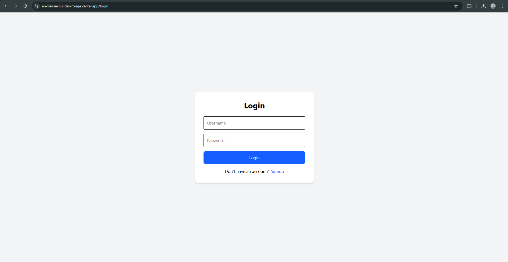</td>
<td>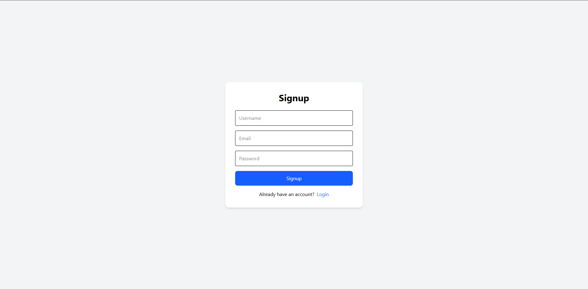</td>
</tr>

<tr>
<td></td>
<td>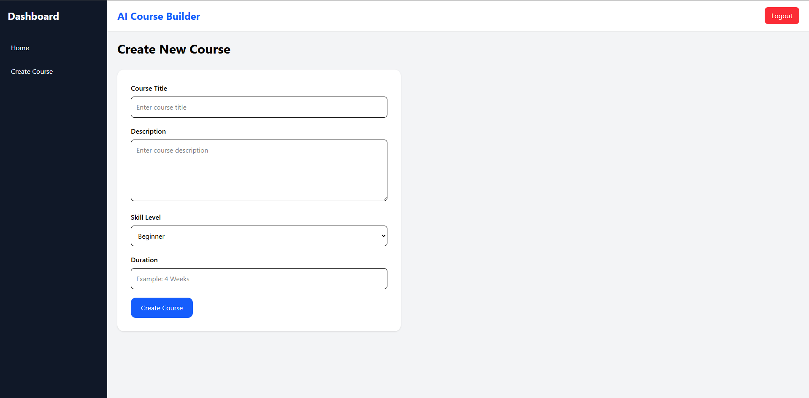</td>
</tr>

<tr>
<td>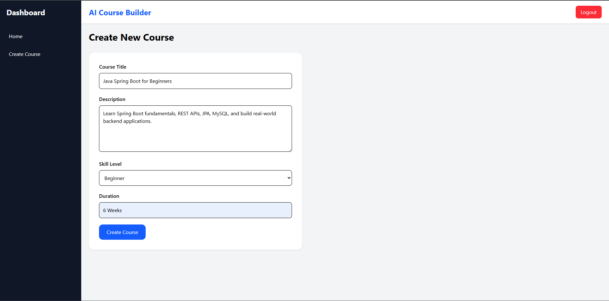</td>
<td>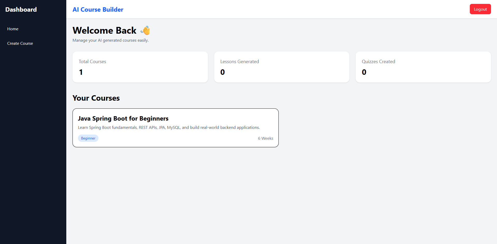</td>
</tr>

<tr>
<td>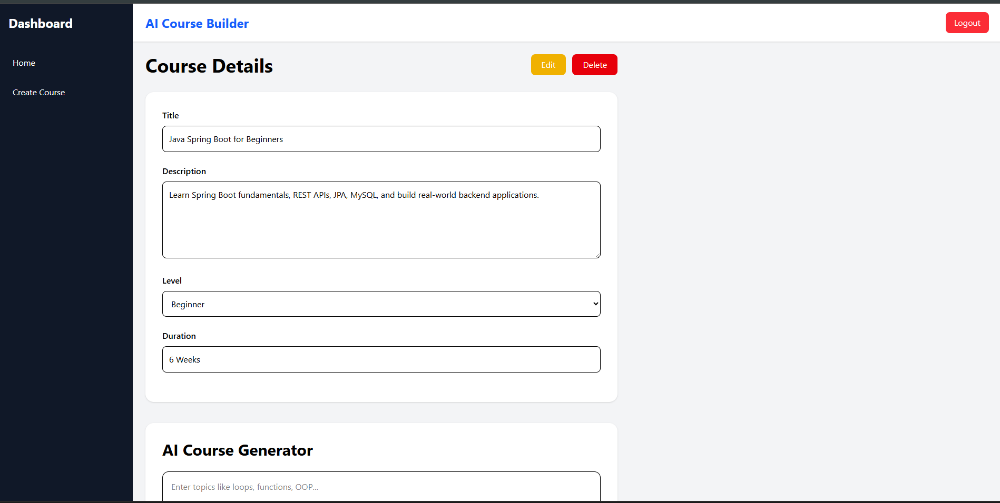</td>
<td>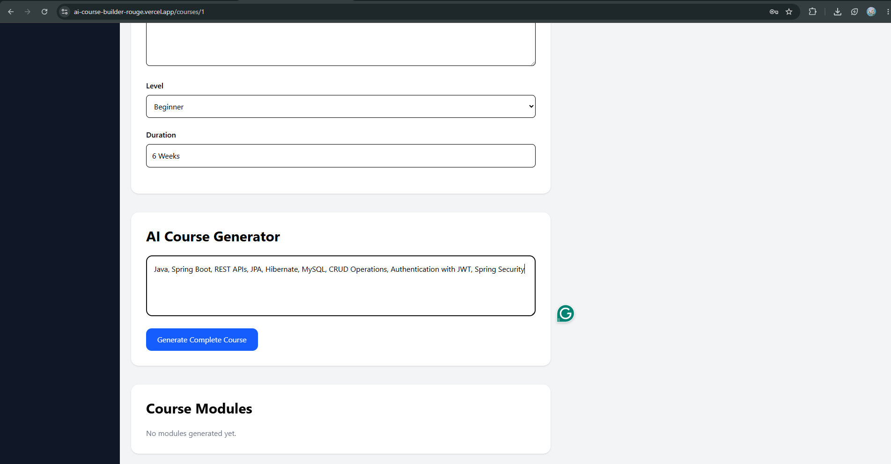</td>
</tr>

<tr>
<td>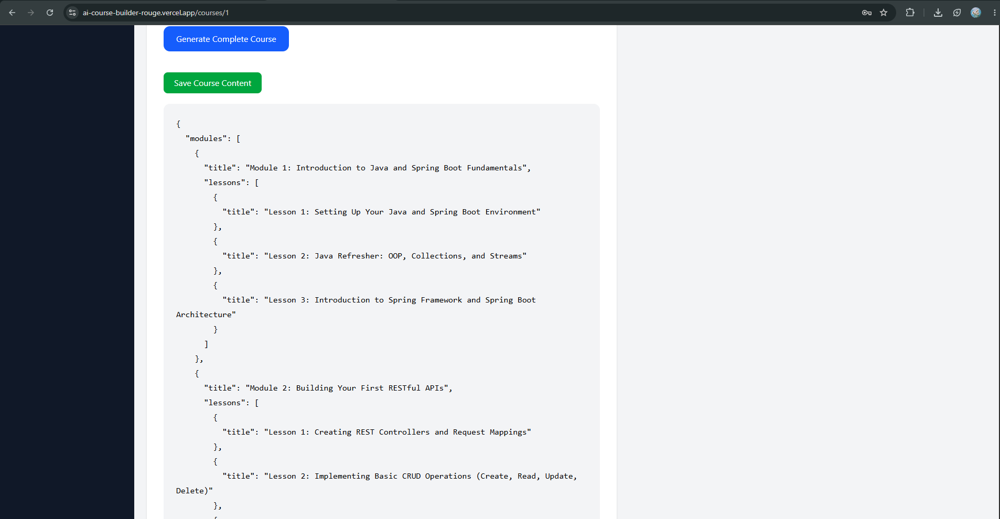</td>
<td>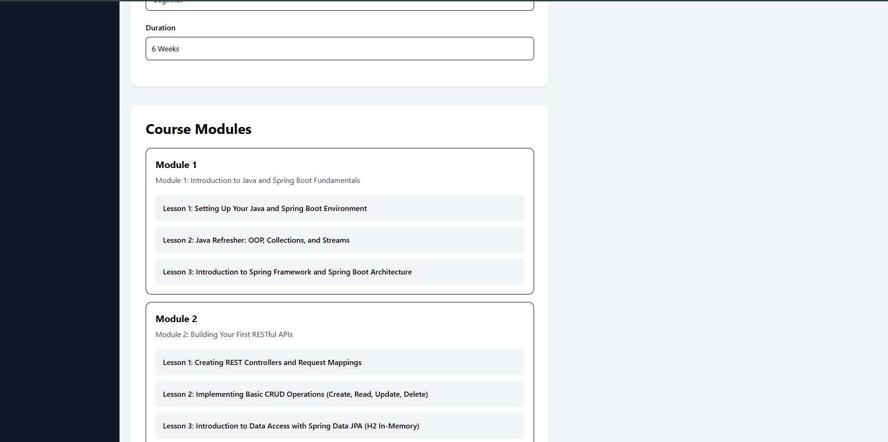</td>
</tr>

<tr>
<td>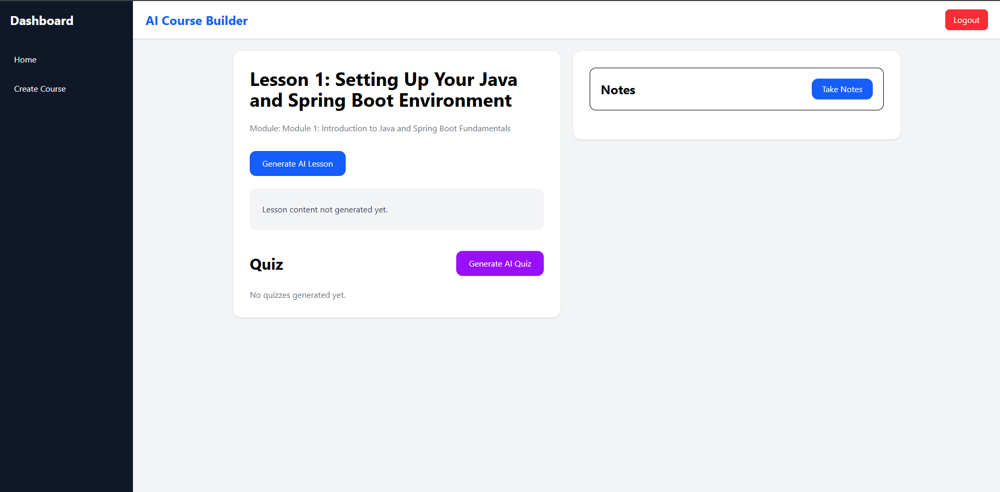</td>
<td>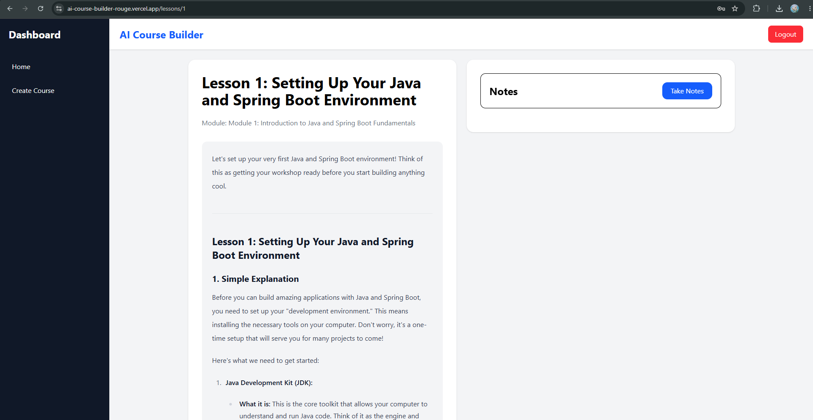</td>
</tr>

<tr>
<td>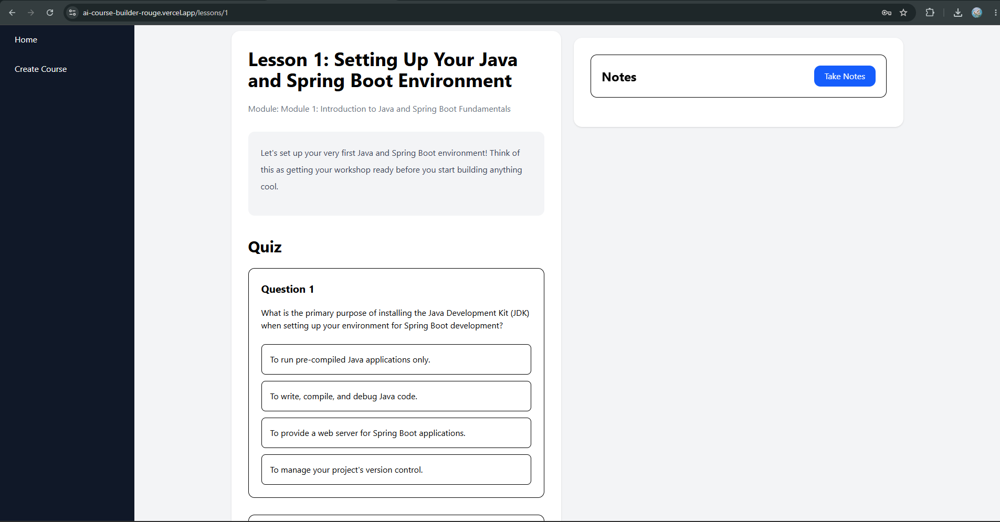</td>
<td>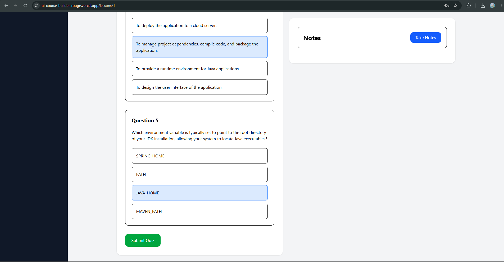</td>
</tr>

<tr>
<td>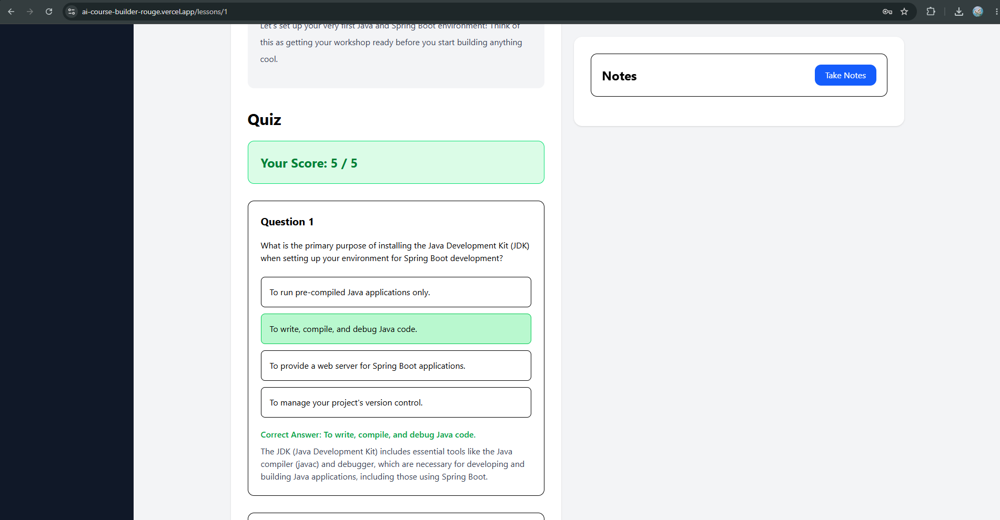</td>
<td>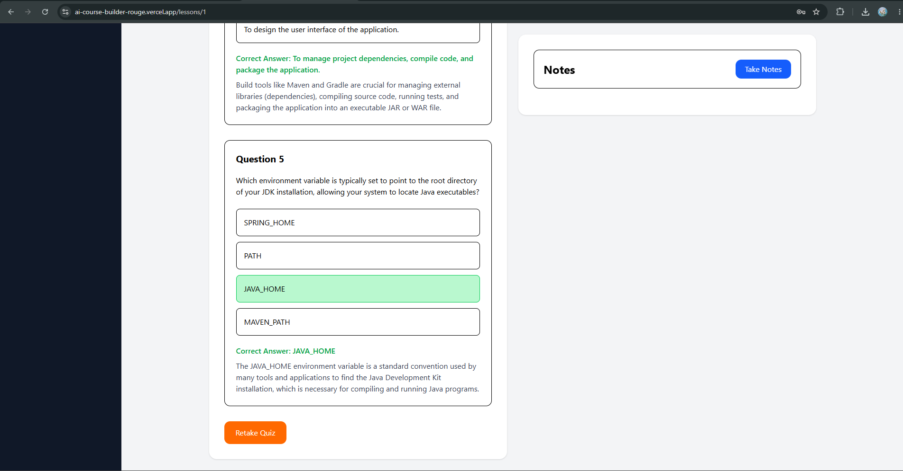</td>
</tr>

<tr>
<td>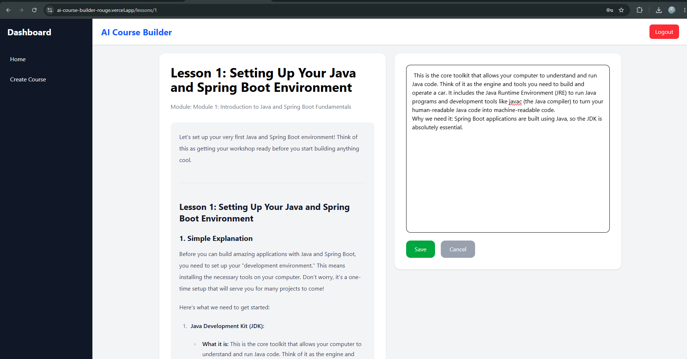</td>
<td>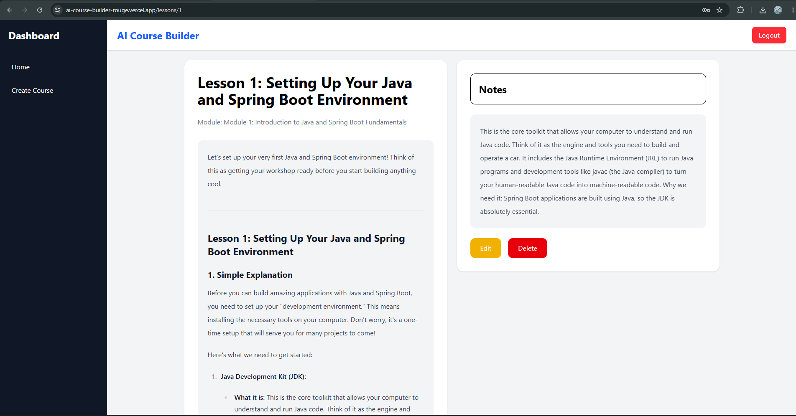</td>
</tr>

<tr>
<td></td>
</tr>

</table>

---

## ⭐ Key Highlights

- AI-generated course syllabus, lesson content, and quizzes (Google Gemini)
- Clean Markdown rendering for AI-generated content (headings, bold text, lists, tables)
- JWT-based authentication
- Per-lesson notes and auto-graded quiz attempts with score tracking
- Fully decoupled frontend/backend architecture, independently deployed
- Environment-based configuration — no secrets committed to the repo

---

## ✨ Features

- 🔐 **Authentication** — JWT-based signup/login, protected routes on the frontend
- 🧠 **AI Syllabus Generation** — describe a course (title, level, duration, topics) and Gemini generates a full modules → lessons structure
- 📄 **AI Lesson Content Generation** — generates detailed lesson content on demand, rendered as clean formatted Markdown (not raw text)
- ❓ **AI Quiz Generation** — auto-generates multiple-choice quizzes per lesson, with explanations
- ✅ **Quiz Attempts & Scoring** — take a quiz, get scored automatically, retake anytime
- 📝 **Lesson Notes** — save, edit, and delete personal notes per lesson, rendered as Markdown
- 📊 **Dashboard** — view all created courses with stats
- 🎨 **Responsive UI** — built with Tailwind CSS v4

---

## 🛠️ Tech Stack

### Frontend
| Layer | Technology |
|---|---|
| Framework | React 19 (Vite 8) |
| Routing | React Router DOM v7 |
| Styling | Tailwind CSS v4 + `@tailwindcss/typography` |
| Markdown Rendering | `react-markdown` + `remark-gfm` |
| HTTP Client | Axios |
| Deployment | Vercel |

### Backend
| Layer | Technology |
|---|---|
| Framework | Django 6.0 + Django REST Framework |
| Authentication | `djangorestframework-simplejwt` (JWT) |
| AI Integration | Google Gemini (`google-genai`) |
| CORS | `django-cors-headers` |
| Database | SQLite |
| WSGI Server | Gunicorn |
| Deployment | Render |

---

## 🏗️ Architecture

```
┌─────────────────────┐         HTTPS / JSON          ┌──────────────────────┐
│   React Frontend     │ ─────────────────────────────▶│   Django REST API    │
│   (Vercel)           │ ◀───────────────────────────── │   (Render)           │
└─────────────────────┘                                └──────────┬───────────┘
                                                                     │
                                                                     ▼
                                                          ┌──────────────────────┐
                                                          │   Google Gemini API   │
                                                          │  (syllabus / lesson /  │
                                                          │      quiz gen)         │
                                                          └──────────────────────┘
```

- The **frontend** and **backend** are two separate apps in one repo (`frontend/`, `backend/`), deployed independently.
- The frontend talks to the backend exclusively over HTTPS via a single `axios` instance (`src/services/api.js`), with the base URL switching automatically between local and production via Vite env files.
- The backend exposes a REST API secured with JWT; AI generation endpoints call Google's Gemini API server-side, so the Gemini API key never reaches the browser.

---

## 📁 Project Structure

```
AI-Course-Builder/
├── backend/
│   ├── core/                  # Django project settings, URL root
│   ├── users/                 # Auth: signup, login (JWT), profile
│   ├── courses/                # Course/Module/Lesson/Quiz/Note models & CRUD API
│   ├── ai/                     # Gemini integration: syllabus/lesson/quiz generation
│   ├── requirements.txt
│   ├── manage.py
│   └── Procfile                 # Render deployment (gunicorn)
│
└── frontend/
    ├── src/
    │   ├── pages/               # Login, Signup, Dashboard, CreateCourse,
    │   │                        # CourseDetails, LessonDetails
    │   ├── components/          # Navbar, Sidebar, CourseCard, StatsCard
    │   ├── layouts/              # DashboardLayout
    │   ├── routes/                # ProtectedRoute (JWT route guard)
    │   ├── services/              # api.js (Axios instance + interceptors)
    │   └── App.jsx                # Route definitions
    ├── .env.development           # Local API URL
    ├── .env.production            # Production API URL
    └── package.json
```

---

## 🗄️ Data Model

| Model | Key Fields | Relationships |
|---|---|---|
| **User** *(Django built-in)* | username, email, password | 1:N → Course, 1:N → QuizAttempt |
| **Course** | title, description, level, duration, created_at | belongs to User · 1:N → Module |
| **Module** | title, order | belongs to Course · 1:N → Lesson |
| **Lesson** | title, content, order | belongs to Module · 1:N → Quiz, Note |
| **Quiz** | question, option1–4, correct_answer, explanation | belongs to Lesson |
| **Note** | content, created_at | belongs to Lesson |
| **QuizAttempt** | selected_answers (JSON), score, created_at, updated_at | belongs to User + Lesson |

---

## 📡 API Reference

Base path: **`/api`**

### 🔑 Authentication — `/api/users`
| Method | Endpoint | Auth | Description |
|---|---|---|---|
| POST | `/users/signup/` | Public | Register a new user |
| POST | `/users/login/` | Public | Log in, receive JWT access + refresh tokens |
| POST | `/users/refresh/` | Public | Refresh an expired access token |
| GET | `/users/profile/` | Authenticated | Get current user info |

### 📚 Courses — `/api`
| Method | Endpoint | Auth | Description |
|---|---|---|---|
| GET / POST | `/courses/` | Authenticated | List user's courses / create a new one |
| GET / PUT / DELETE | `/courses/<id>/` | Authenticated | Retrieve, update, or delete a course |
| GET | `/lessons/<id>/` | Authenticated | Get full lesson detail |
| GET / POST | `/lessons/<lesson_id>/notes/` | Authenticated | List / add notes for a lesson |
| PUT / DELETE | `/notes/<note_id>/` | Authenticated | Update or delete a note |
| GET / POST / DELETE | `/lessons/<lesson_id>/quiz-attempt/` | Authenticated | Get, submit, or retake a quiz attempt |

### 🤖 AI Generation — `/api/ai`
| Method | Endpoint | Auth | Description |
|---|---|---|---|
| POST | `/ai/generate-syllabus/` | Authenticated | Generate a full course structure (modules + lessons) from a title/level/duration/topics |
| POST | `/ai/save-syllabus/` | Authenticated | Persist the generated syllabus as Course/Module/Lesson records |
| POST | `/ai/generate-lesson-content/` | Authenticated | Generate full lesson content for a given lesson |
| POST | `/ai/generate-quiz/` | Authenticated | Generate a multiple-choice quiz for a given lesson |

---

## 🔐 Authentication

- JWT-based, via `djangorestframework-simplejwt`.
- On login, the backend returns an **access token** and a **refresh token**; the frontend stores these in `localStorage`.
- The frontend's Axios instance (`src/services/api.js`) automatically attaches `Authorization: Bearer <token>` to every request **except** `signup` and `login`, since those don't require authentication.
- Automatically clears stale or invalid JWT tokens when a request receives a 401 Unauthorized response, preventing authentication loops after expired sessions or backend database resets.
- Protected frontend routes are wrapped in `<ProtectedRoute>`, which redirects unauthenticated users to `/login`.

---

## ⚙️ Installation & Setup (Local Development)

### Prerequisites
- Python 3.11+
- Node.js 18+
- A [Google Gemini API key](https://ai.google.dev/)

### 1. Clone the repository
```bash
git clone https://github.com/Sakthi145/AI-Course-Builder.git
cd AI-Course-Builder
```

### 2. Backend setup
```bash
cd backend
python -m venv env
env\Scripts\activate        # Windows
# source env/bin/activate   # macOS/Linux

pip install -r requirements.txt
```

Create a `.env` file inside `backend/` (see [Environment Variables](#-environment-variables) below), then:
```bash
python manage.py migrate
python manage.py runserver
```
Backend runs at `http://127.0.0.1:8000`.

### 3. Frontend setup
```bash
cd frontend
npm install
npm run dev
```
Frontend runs at `http://localhost:5173`.

The frontend automatically points to `http://127.0.0.1:8000/api` in development (via `.env.development`) and to the live Render backend in production (via `.env.production`) — no manual switching needed.

---

## 🔧 Environment Variables

### Backend (`backend/.env`) — not committed to the repo
```env
GEMINI_API_KEY=your_google_gemini_api_key

DJANGO_SECRET_KEY=your_django_secret_key
DJANGO_DEBUG=True
DJANGO_ALLOWED_HOSTS=localhost,127.0.0.1
CORS_ALLOWED_ORIGINS=http://localhost:5173
```

| Variable | Description |
|---|---|
| `GEMINI_API_KEY` | Google Gemini API key used for syllabus/lesson/quiz generation |
| `DJANGO_SECRET_KEY` | Django's cryptographic signing key |
| `DJANGO_DEBUG` | `True` locally, `False` in production |
| `DJANGO_ALLOWED_HOSTS` | Comma-separated list of allowed hostnames |
| `CORS_ALLOWED_ORIGINS` | Comma-separated list of frontend origins allowed to call the API |

**In production (Render)**, the same variables are set in Render's Environment dashboard, with production-appropriate values (`DJANGO_DEBUG=False`, the actual Render + Vercel domains).

### Frontend (`frontend/.env.development` and `.env.production`) — committed, no secrets
```env
# .env.development
VITE_API_BASE_URL=http://127.0.0.1:8000/api

# .env.production
VITE_API_BASE_URL=https://ai-course-builder-9qqo.onrender.com/api
```
Vite automatically loads the right file based on whether you run `npm run dev` (development) or `npm run build` (production) — this is why no secrets or manual URL-switching are needed on the frontend.

---

## 🚀 Deployment

| Service | Platform | URL |
|---|---|---|
| Frontend | Vercel | [ai-course-builder-rouge.vercel.app](https://ai-course-builder-rouge.vercel.app/login) |
| Backend | Render | `ai-course-builder-9qqo.onrender.com` |

- **Frontend** deploys automatically to Vercel on every push to `main` (Vite build output).
- **Backend** deploys automatically to Render on every push to `main`, running via Gunicorn (`Procfile`: `web: gunicorn core.wsgi`).

### ⚠️ Known limitation — database persistence

The backend currently uses **SQLite**, and Render's free tier has an **ephemeral filesystem** — every backend redeploy resets the database, which means all users, courses, and lesson data are wiped. This is a known limitation of the current (v1) deployment setup, not a bug in the application logic.

**Planned fix (v2):** migrate to a persistent database (e.g., Render's managed PostgreSQL) so data survives redeploys. This is intentionally deferred to keep v1 focused and shippable — noted here transparently rather than presented as production-ready today.

---

## 🚀 Future Improvements

- [ ] Migrate from SQLite to PostgreSQL for persistent production data
- [ ] Add automated tests (currently only scaffolded, no test coverage)
- [ ] Course progress tracking (% complete per course)
- [ ] Export course/lesson content to PDF
- [ ] Rich text editor for manually editing AI-generated lesson content
- [ ] Replace `alert()`/`console.log` error handling with a proper toast notification system
- [ ] Public course sharing (share a generated course via link)
- [ ] Dark mode

---

## 📄 License

This project is distributed under the **Educational and Portfolio License**. See the `LICENSE` file for details.
---

## ✍️ Author

**S. Sakthi**
🔗 GitHub: [https://github.com/Sakthi145](https://github.com/Sakthi145)

---

<p align="center">Built with React, Django, and Google Gemini</p>